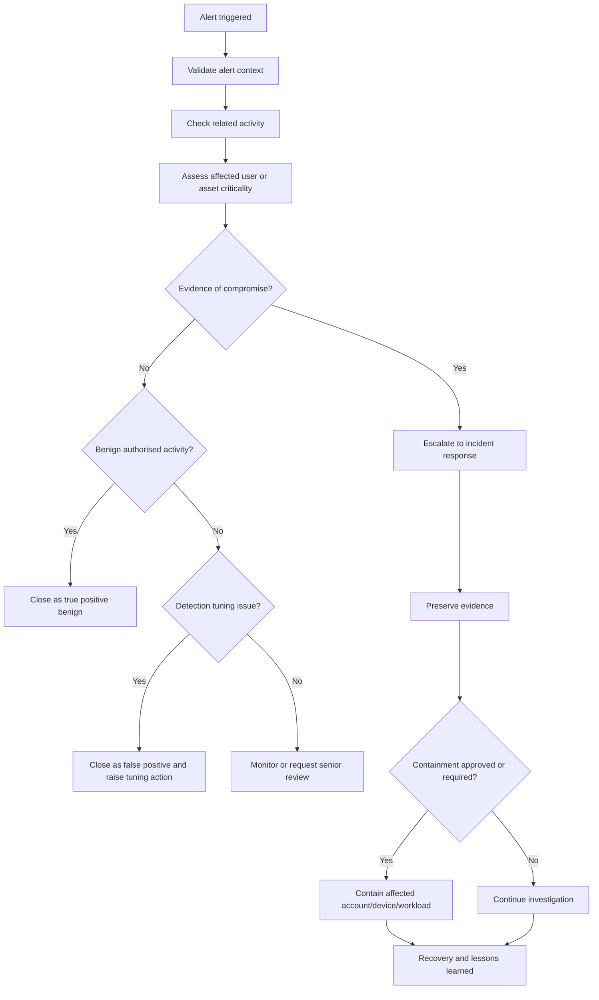
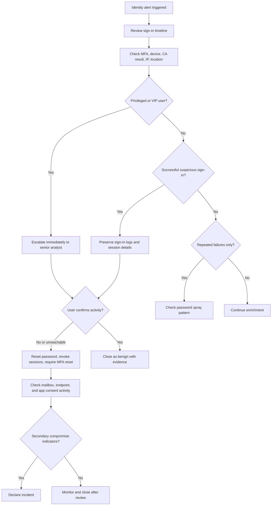
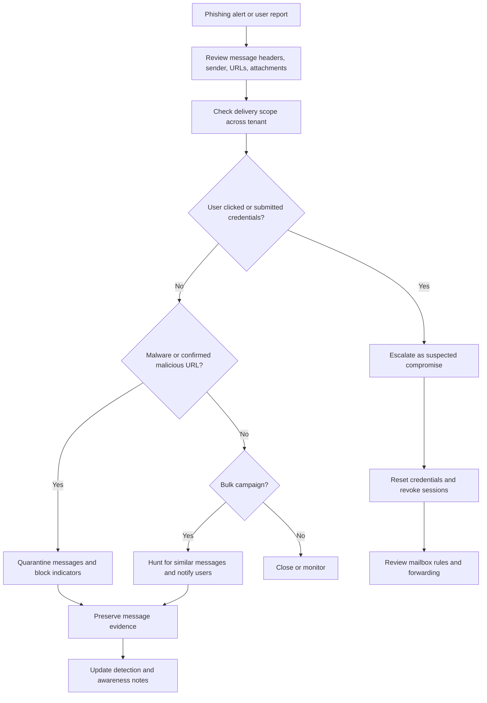
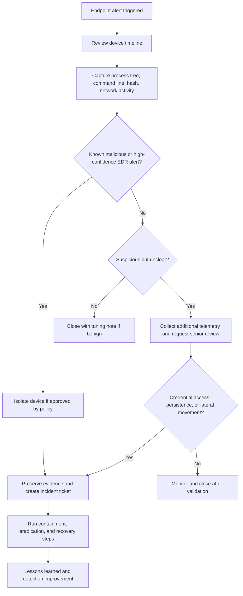
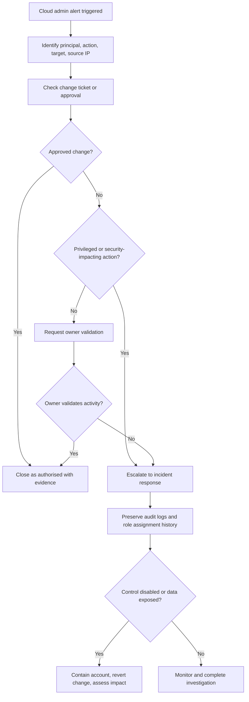

# Visual Playbook Flowcharts

Use Mermaid diagrams to make response logic easy to follow during live operations. Each playbook should include a decision tree that shows triage, escalation, containment, communication, and closure paths.

## Mermaid usage

GitHub renders Mermaid diagrams directly in Markdown. Keep diagrams simple enough for an analyst to follow quickly.

## Generic alert response flow

## Identity compromise playbook

## Phishing response playbook

## Endpoint malware or suspicious process playbook

## Cloud admin activity playbook

## Playbook quality checklist

| Check | Yes/No | Notes |
| --- | --- | --- |
| Trigger condition is clear. |  |  |
| First analyst action is obvious. |  |  |
| VIP, privileged, or critical asset branch exists. |  |  |
| Evidence preservation step exists before closure or containment. |  |  |
| Escalation criteria are explicit. |  |  |
| Closure categories are clear. |  |  |
| Irreversible actions require approval or policy reference. |  |  |
| Diagram renders correctly in GitHub. |  |  |

## Diagram style guide

- Use short node labels.
- Use decision nodes for `Yes/No` paths.
- Keep each diagram focused on one incident type.
- Link each flowchart to a written procedure and detection record.
- Avoid putting secrets, customer names, or real incident details in diagrams.
