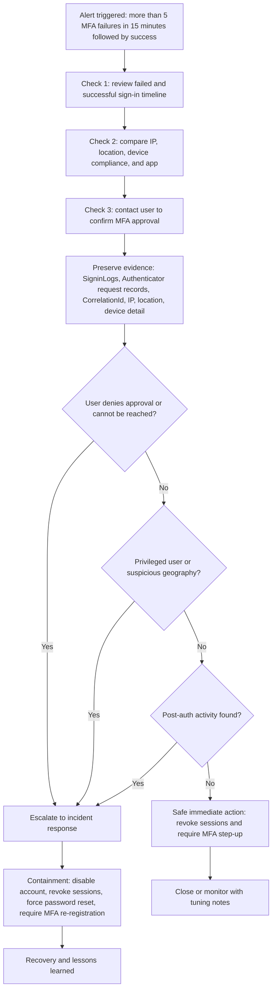
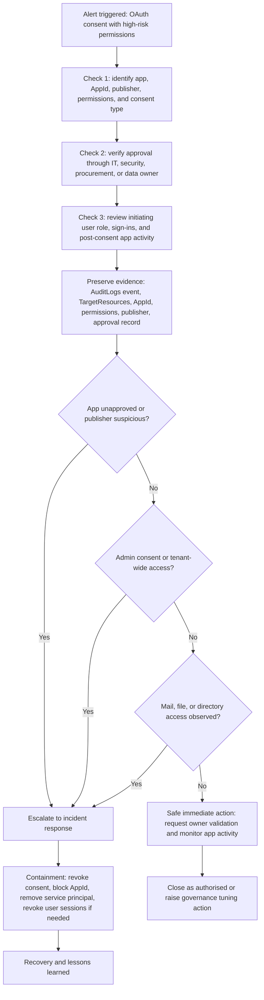
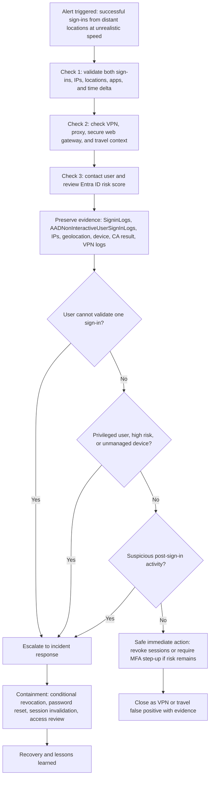
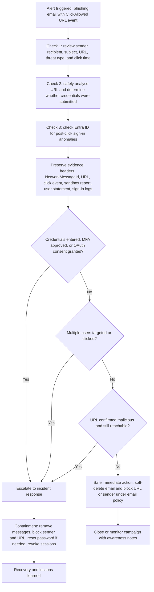
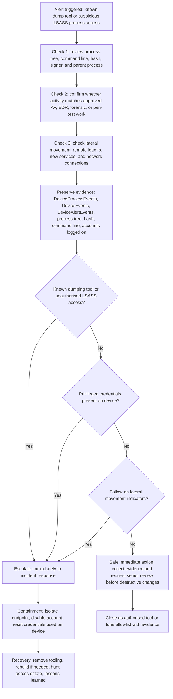

# Visual Playbook Flowcharts

Use Mermaid diagrams to make response logic easy to follow during live operations. Each flowchart should help an analyst answer five operating questions:

1. What triggered the alert?
2. What are the first three checks?
3. What evidence must be preserved?
4. When do I escalate?
5. What action is safe to take immediately?

## Mermaid usage

GitHub renders Mermaid diagrams directly in Markdown. Keep diagrams simple, use `flowchart TD`, and use decision diamonds for escalation criteria.

## UC-IDENTITY-001 MFA Fatigue Attack

## UC-IDENTITY-002 Malicious OAuth App Consent

## UC-CLOUD-001 Impossible Travel

## UC-EMAIL-001 Phishing Credential Harvest

## UC-ENDPOINT-001 Possible LSASS Credential Dump

## Playbook quality checklist

| Check | Yes/No | Notes |
| --- | --- | --- |
| Trigger condition is clear. |  |  |
| First three analyst checks are clear. |  |  |
| Evidence preservation step exists before closure or containment. |  |  |
| Decision diamonds identify escalation criteria. |  |  |
| Safe immediate action is documented. |  |  |
| Closure, containment, and recovery paths are clear. |  |  |
| Irreversible actions require approval or policy reference. |  |  |
| Diagram renders correctly in GitHub. |  |  |

## Diagram style guide

- Use short node labels.
- Use decision nodes for `Yes/No` paths.
- Keep each diagram focused on one incident type.
- Link each flowchart to a written procedure and detection record.
- Avoid putting secrets, customer names, or real incident details in diagrams.
